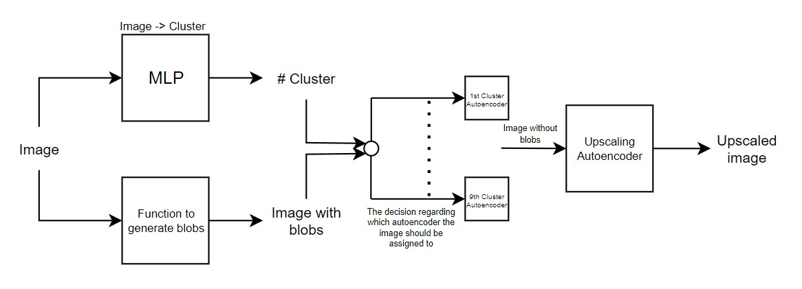

# Artwork Genre Clustering and Restoration with Autoencoders  

### System Architecture  
  
Refer to the system architecture diagram above for detailed insights into the workflow.

---

## 📚 Project Overview  
This project leverages advanced computer vision techniques and unsupervised learning to differentiate artwork genres through clustering and restore damaged or missing sections of paintings. By designing and implementing multiple autoencoders, the project identifies clusters of artwork genres and enhances convolutional neural networks (CNNs) for image reconstruction.  

---

### Key Highlights  
- **Clustering**: Autoencoders are employed to differentiate genres of artwork using unsupervised learning. The latent bottleneck representations are further used to perform clustering with the **Gaussian Mixture Algorithm**.  
- **Restoration**: Results from clustering are leveraged to optimize CNN architectures for reconstructing damaged or incomplete paintings.  
- **Upscaling**: Enhanced CNN architectures are also utilized for **upscaling low-resolution images** of artwork, improving clarity and detail.  
- **Optimization**: Extensive experimentation ensures optimal model architectures and training parameters, demonstrating state-of-the-art image restoration techniques.  

---

## 👥 Creators  

- **[HaZhul](https://github.com/HaZhul)** 
    - Designed and implemented the **architecture of the neural networks**, focusing on clustering, restoration, and upscaling. 
- **[FoxTold](https://github.com/FoxTold)** 
    - Focused on **application development**, ensuring the integration and usability of the models for practical use cases.  

Feel free to contribute to the project!  